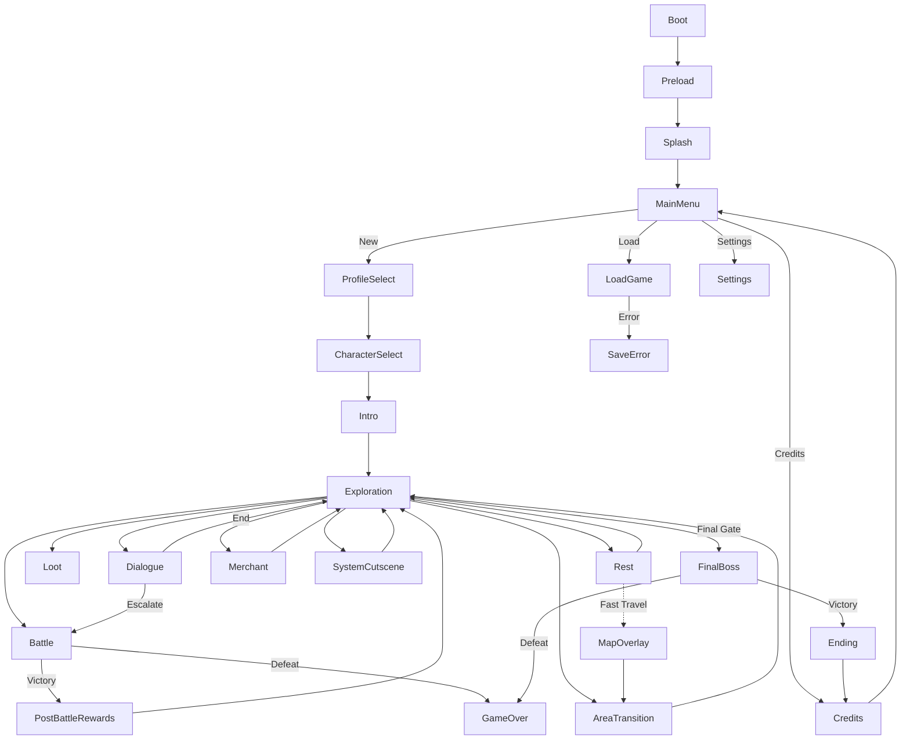

# Scene Flow Map — Schema Only (Overlays for Menus)
_Last updated: 2025-09-26_

This is the canonical **scene/state graph**. It is **systemic** (no narrative).  
All routeable states are **Scenes** (`app/scenes/`). Modal UI on top of scenes are **Overlays** (`app/overlays/`).

---

## 0) Conventions
- **Scenes** change the router state (full screen or primary context).
- **Overlays** are modal panes that capture input, render atop the current scene, and return focus to the caller.
- Transitions are specified as `From → To [condition]`. Narrative reasons are omitted.
- Journal, Inventory, Character, and Map are **Overlays** (opened from Exploration or Rest).

---

## 1) Boot & Entry (Scenes)
- **BootScene** → **PreloadScene**
- **PreloadScene** → **SplashScene**
- **SplashScene** → **MainMenuScene**

## 2) Main Menu & Globals (Scenes)
- **MainMenuScene**
  - New Game → **ProfileSelectScene** → **CharacterSelectScene**
  - Load Game → **LoadGameScene**
  - Settings → **SettingsScene**
  - Credits → **CreditsScene**
  - Quit → OS exit
- **ProfileSelectScene** ↔ **MainMenuScene**
- **CharacterSelectScene** → **IntroScene**
- **LoadGameScene** → saved scene | **SaveErrorScene**
- **SettingsScene** → returns to caller
- **CreditsScene** → **MainMenuScene**
- **SaveErrorScene** → **LoadGameScene** | **MainMenuScene**

## 3) Intro & Onboarding (Scenes)
- **IntroScene** → **ExplorationScene**

## 4) Core Gameplay Loop (Scenes + Overlays)
- **ExplorationScene**
  - To scenes: **DialogueScene**, **BattleScene**, **LootScene**, **RestScene**, **AreaTransitionScene**, **MerchantScene**, **SystemCutsceneScene**
  - Overlays available in Exploration:
    - **LanternaHUDOverlay**, **NotificationOverlay**, **StatusEffectsOverlay**, **TargetInfoOverlay**, **SkillCheckOverlay**, **PromptOverlay**, **PauseOverlay**
    - **JournalOverlay** (tabs: Quests / Notes / Codex)
    - **InventoryOverlay**
    - **CharacterOverlay**

- **DialogueScene**
  - End → **ExplorationScene**
  - Escalate → **BattleScene**

- **BattleScene**
  - Victory → **PostBattleRewardsScene**
  - Defeat → **GameOverScene**

- **PostBattleRewardsScene** → **ExplorationScene**

- **LootScene** → **ExplorationScene**

- **RestScene**
  - Heal/Save/Manage
  - **MapOverlay** (Fast Travel between discovered Embers)
  - Exit → **ExplorationScene**

- **MerchantScene** → **ExplorationScene**

- **AreaTransitionScene** → **ExplorationScene**

- **SystemCutsceneScene** → caller (usually **ExplorationScene**)

## 5) End States (Scenes)
- **FinalBossScene**
  - Victory → **EndingScene**
  - Defeat → **GameOverScene**
- **EndingScene** → **CreditsScene** → **MainMenuScene**
- **GameOverScene** → reload last save | **MainMenuScene**

---

## 6) File Manifest Target

**Scenes (`app/scenes/`):**
- BootScene.js
- PreloadScene.js
- SplashScene.js
- MainMenuScene.js
- ProfileSelectScene.js
- CharacterSelectScene.js
- LoadGameScene.js
- SettingsScene.js
- CreditsScene.js
- SaveErrorScene.js
- IntroScene.js
- ExplorationScene.js
- DialogueScene.js
- BattleScene.js
- PostBattleRewardsScene.js
- LootScene.js
- RestScene.js
- MerchantScene.js
- AreaTransitionScene.js
- SystemCutsceneScene.js
- FinalBossScene.js
- EndingScene.js
- GameOverScene.js

**Overlays (`app/overlays/`):**
- PauseOverlay.js
- LanternaHUDOverlay.js
- NotificationOverlay.js
- StatusEffectsOverlay.js
- TargetInfoOverlay.js
- SkillCheckOverlay.js
- PromptOverlay.js
- JournalOverlay.js  _(tabs: Quests / Notes / Codex)_
- InventoryOverlay.js
- CharacterOverlay.js
- MapOverlay.js  _(fast travel, launched from RestScene)_

---

## 7) Minimal Mermaid (Schema)

